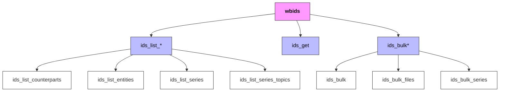

<!-- README.md is generated from README.Rmd. Please edit that file -->

# wbids

<!-- badges: start -->

[](https://cran.r-project.org/package=wbids)
[](https://cran.r-project.org/package=wbids)
[](https://github.com/Teal-Insights/r-wbids/actions/workflows/R-CMD-check.yaml)
[](https://github.com/Teal-Insights/r-wbids/actions/workflows/lint.yaml)
[](https://app.codecov.io/gh/Teal-Insights/r-wbids)
<!-- badges: end -->

`wbids` is an R package to access and analyze the World Bank’s
[International Debt Statistics
(IDS)](https://www.worldbank.org/en/programs/debt-statistics/ids). IDS
provides creditor-debtor relationships between countries, regions, and
institutions. ‘wbids’ enables users to download, process and work with
IDS series across multiple entities, counterparts, and time periods.

The `wbids` package relies on a redefinition of the original World Bank
data: ‘entities’ contain both countries and regions, while
‘counterparts’ include both counterpart areas and institutions. `wbids`
provides a consistent mapping of identifiers and names across these
different types. The corresponding [package
vignette](https://teal-insights.github.io/r-wbids/articles/data-model.html)
provides more details on the data model.

The package is part of the
[EconDataverse](https://www.econdataverse.org/) family of packages aimed
at helping economists and financial professionals work with
sovereign-level economic data.

This package is a product of Teal Insights and not sponsored by or
affiliated with the World Bank in any way, except for the use of the
World Bank IDS API.

## Installation

You can install `wbids` from
[CRAN](https://CRAN.R-project.org/package=wbids) via:

``` r
install.packages("wbids")
```

You can also install the development version of `wbids` like this:

``` r
# install.packages("pak")
pak::pak("teal-insights/r-wbids")
```

On Linux, you may need to install `libcurl4-openssl-dev` as a
prerequisite to build the package.

## Usage

The main function `ids_get()` provides an interface to download multiple
IDS series for multiple entities and counterparts and specific date
ranges.

``` r
library(wbids)

ids_get(
  geographies = c("ZMB", "ZAF"),
  series = c("DT.DOD.DPPG.CD", "BM.GSR.TOTL.CD"),
  counterparts = c("216", "231"),
  start_year = 2015,
  end_year = 2020
)
```

The package comes with prepared metadata about available series,
entities, counterparts, and topics. Please consult the [package
vignette](https://teal-insights.github.io/r-wbids/articles/data-model.html)
for details.

``` r
ids_list_series()
ids_list_entities()
ids_list_counterparts()
ids_list_series_topics()
```

This data can be used to enrich the IDS series or facilitate data
discovery. For further applications, please consult [Teal Insights’
Guide to Working with the World Bank International Debt
Statistics](https://teal-insights.github.io/teal-insights-guide-to-wbids/).

The interface and column names are fully consistent with World
Development Indicators (WDI) data provided through the `wbwdi` package.
You can find details on
[github.com/tidy-intelligence/r-wbwdi](https://github.com/tidy-intelligence/r-wbwdi).

## Contributing

Contributions to `wbids` are welcome! If you’d like to contribute,
please follow these steps:

1.  **Create an issue**: Before making changes, create an issue
    describing the bug or feature you’re addressing.
2.  **Fork the repository**: Fork the repository to your GitHub account.
3.  **Create a branch**: Create a branch for your changes with a
    descriptive name.
4.  **Make your changes**: Implement your bug fix or feature.
5.  **Test your changes**: Run tests to ensure your changes don’t break
    existing functionality.
6.  **Submit a pull request**: Push your changes to your fork and submit
    a pull request to the main repository.

For more detailed information on the package structure and development
process, please visit the [project
Wiki](https://github.com/Teal-Insights/r-wbids/wiki).

### Package Structure

The package is organized around three main functional groups:


